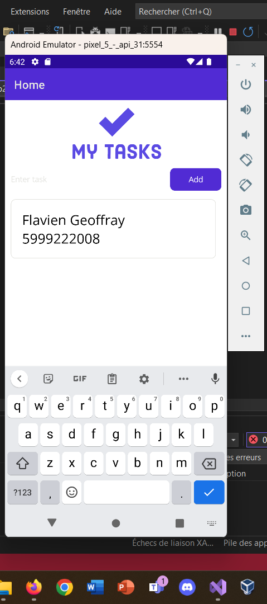

# FBP-FG-ex008-DataBindingMVVM2
Data Binding with MVVM &amp; XAML

Little app using data binding & Model View ViewModel
User can create a task & delete it by tilting left

https://user-images.githubusercontent.com/97790963/225229705-b64d4452-6510-4a0e-a20c-9b6dc60a39e0.mp4

